  <!-- Synthwave Header Image -->
  
  
   
  
  <!-- Neon Typing Effect -->
  <h1>
    
  </h1>
  
  <!-- Neon Social Badges -->
  

    
    
    
  

---

### 🌌 Ａｂｏｕｔ　Ｍｅ

*Entering Cyberspace... Data uploaded.*

- 🔭 **Current Focus:** Deep Learning, Reinforcement Learning, and NLP architectures.
- 🌱 **Currently exploring:** Agentic AI, Large Language Models (LLMs), and Reinforcement Learning from Human Feedback (RLHF).
- 🧠 **AI philosophy:** Building robust, scalable, and intelligent models for the future of tech.
- ⚡ **Fun fact:** When I'm not training models, I'm diving into the retro-future.

 

### 💻 Ｔｅｃｈ　Ｓｔａｃｋ

  <!-- Neon Tech Stack Badges (Black background with neon logos) -->
  
  
  
  
  
  
  

 

### 📊 Ｓｔａｔｓ

  <!-- This image is generated internally by your GitHub Action! -->
  

<!-- We are keeping this one as is, since your screenshot shows it working perfectly! -->

  

